# 🚀 TrackerApp - Android GPS Tracker with Traccar Integration

TrackerApp is a modern Android application that communicates with a locally hosted **Traccar server** to simulate real-time GPS tracking scenarios – ideal for IoT & communication system use cases.

---

## 📋 Table of Contents

- [Features](#-features)
- [Built With](#-built-with)
- [Demo](#-demo)
- [Architecture](#-architecture)
- [Setup](#-setup)
- [Permissions](#-permissions)
- [Time Limit](#-time-limit)
- [Troubleshooting](#-troubleshooting)
- [License](#-license)
- [Author](#-author)

---

## ✨ Features

- 📍 **Real-time GPS tracking** using FusedLocationProvider
- 🔄 **Traccar Integration** - Sends location updates via OsmAnd Protocol (port 5055)
- 🧠 **MVVM Architecture** - Clean separation with ViewModel + Service
- 📡 **Foreground Service** with persistent notification
- 🗺️ **Google Maps Integration** with live location and polyline tracking
- 📥 **Auto Device Registration** via Traccar API (`/api/devices`)
- 🔁 **Data Persistence** - Reuses `deviceId` using SharedPreferences
- 🚫 **Error Handling** - Graceful network failures and missing GPS handling
- ✅ **Android 10+ Compatible**

---

## 🛠️ Built With

| **Category**  | **Technology**              |
|---------------|-----------------------------|
| Language      | Kotlin                      |
| UI Framework  | XML + Google Maps SDK       |
| Location API  | FusedLocationProviderClient |
| Networking    | HttpURLConnection           |
| Architecture  | MVVM Pattern                |
| Local Storage | SharedPreferences           |

---

## 🎬 Demo

### 📱 App Screenshots

<div align="center">
  
  
  
  
</div>

<div align="center">
  
  
  
  
</div>

<div align="center">
  
  
  
</div>

### 🖥️ Traccar Dashboard

<div align="center">
  
  <br/><br/>
  
  <br/><br/>
  
  <br/><br/>
  
</div>

### 🎥 Video Demonstrations

<p align="center">
  <a href="https://www.youtube.com/watch?v=1cmfAVSCMdo" target="_blank">
    
  </a>
  <a href="https://www.youtube.com/watch?v=xFzpzbSPDA8" target="_blank">
    
  </a>
</p>

---

## 🏗️ Architecture

### Project Structure

```
TrackerApp/
├── app/src/main/java/
│   ├── MainActivity.kt          # Main UI Controller
│   ├── MainViewModel.kt         # MVVM ViewModel
│   ├── TrackingService.kt       # Background Location Service
│   └── DeviceManager.kt         # Device Registration Logic
├── app/src/main/res/
│   ├── layout/                  # XML Layouts
│   ├── drawable/                # App Icons & Graphics
│   └── raw/map_style.json       # Google Maps Styling
├── screenshots/                 # Demo Images
└── README.md                    # This File
```

### System Architecture Flow

```mermaid
graph TB
    subgraph "📱 Android App"
        A[MainActivity.kt] --> B[MainViewModel.kt]
        B --> C[TrackingService.kt]
        C --> D[DeviceManager.kt]
        E[📍 GPS Provider] --> C
        F[🗺️ Google Maps] --> A
    end
    
    subgraph "🌐 Network Layer"
        G[HTTP Client]
        H[OsmAnd Protocol]
    end
    
    subgraph "🖥️ Traccar Server"
        I[Web Interface :8082]
        J[Location Receiver :5055]
        K[REST API /api/devices]
        L[📊 Dashboard]
    end
    
    C --> G
    D --> G
    G --> H
    H --> J
    G --> K
    J --> L
    K --> L
    I --> L
    
    style A fill:#4CAF50
    style B fill:#2196F3
    style C fill:#FF9800
    style D fill:#9C27B0
    style L fill:#F44336
```



### Data Flow Diagram

```mermaid
sequenceDiagram
    participant App as 📱 Android App
    participant Service as 🔄 Tracking Service
    participant GPS as 📍 GPS Provider
    participant Traccar as 🖥️ Traccar Server
    participant Dashboard as 📊 Web Dashboard
    
    App->>Service: Start Tracking
    Service->>GPS: Request Location Updates
    GPS-->>Service: Location Data
    Service->>Traccar: POST Location (Port 5055)
    Service->>App: Update UI & Map
    Traccar->>Dashboard: Process & Display
    
    Note over Service,Traccar: OsmAnd Protocol
    Note over App,Dashboard: Real-time Updates
```



---

## 🚀 Setup

### 1. Traccar Server Setup

1. **Download Traccar**
   ```bash
   # Download from https://www.traccar.org/download
   # Extract and run the server
   ```

2. **Start Server**
   - Default URL: `http://localhost:8082`
   - Login credentials:
     - **Username:** `admin`
     - **Password:** `admin`

3. **Configure Ports**
   - Ensure port `5055` is open for location updates
   - Web interface runs on port `8082`

### 2. Android App Setup

1. **Clone Repository**
   ```bash
   git clone https://github.com/mahmoud024/TrackerApp.git
   cd TrackerApp
   ```

2. **Open in Android Studio**
   - Import the project
   - Sync Gradle files

3. **Add Google Maps API Key**
   
   Add to `AndroidManifest.xml` inside `<application>` tag:
   ```xml
   <meta-data
       android:name="com.google.android.geo.API_KEY"
       android:value="YOUR_API_KEY_HERE"/>
   ```

4. **Configure Server Address**
   - **Emulator:** Use `http://10.0.2.2:5055`
   - **Physical Device:** Use your computer's local IP + `:5055`

5. **Build & Run**
   - Connect your device or start emulator
   - Grant required permissions
   - Start tracking!

---

## 🔐 Permissions

| **Permission** | **Purpose** | **Required When** |
|----------------|-------------|-------------------|
| `ACCESS_FINE_LOCATION` | Get precise GPS coordinates | Always |
| `ACCESS_BACKGROUND_LOCATION` | Track location when app is closed | Android 10+ |
| `INTERNET` | Send data to Traccar server | Always |
| `FOREGROUND_SERVICE` | Run background location service | Always |

---

## ⏰ Time Limit

**⚠️ Development Constraint:**
Please limit your total time investment to **6 hours** for this project setup and implementation.

### 📊 Recommended Time Allocation:


**Time Breakdown:**
- **🔧 Setup & Configuration:** 1.2 hours
  - Traccar server setup
  - Android Studio configuration
  - API keys and dependencies
- **💻 Core Implementation:** 3 hours
  - Location tracking service
  - UI development
  - Traccar integration
- **🧪 Testing & Debugging:** 1.2 hours
  - Device testing
  - Network troubleshooting
  - Permission handling
- **📝 Documentation:** 0.6 hours
  - Code comments
  - README updates

**Why This Constraint?**
- 🎯 **Focus on Essentials** - Prioritize core functionality
- ⚡ **Efficient Development** - Encourage best practices
- 📚 **Learning Optimization** - Realistic timeline for skill building
- 🔄 **Iterative Approach** - Build MVP first, enhance later

---

## ❗ Troubleshooting

### Device Not Showing in Traccar?

1. **Check Network Connection**
   - Verify server IP address is correct
   - Ensure port 5055 is accessible
   - Test with: `telnet YOUR_SERVER_IP 5055`

2. **Verify Device Registration**
   - Check Traccar logs for device registration
   - Default `uniqueId`: `Mahmoud159753`
   - Look for device in Traccar admin panel

### No Location on Map?

1. **GPS Settings**
   - Enable GPS/Location services
   - Grant location permissions to app
   - Try outdoor location for better signal

2. **App Permissions**
   - Check all permissions are granted
   - For Android 10+, enable "Allow all the time" for location

### Network Issues?

1. **Firewall/Network**
   - Check firewall settings on server
   - Ensure device and server are on same network
   - Try different port if 5055 is blocked

---

## 👨‍💻 Author

**Mahmoud Atia**

- 🌐 [GitHub Profile](https://github.com/mahmoud024)

---

<div align="center">
  <h3>⭐ Don't forget to star this repo if you found it helpful!</h3>
  <p>Made with ❤️ by Mahmoud Atia</p>
</div>
